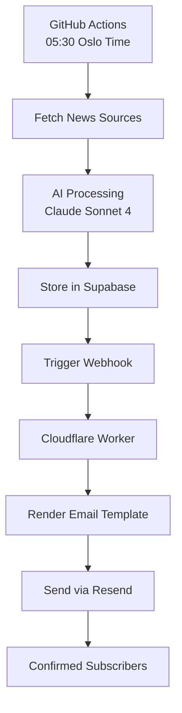

# 🤖 Budbringer

**AI-powered daily newsletter service for Norwegian recipients**

Budbringer is a fully automated AI newsletter system that generates and delivers daily AI briefings in Norwegian. Built with modern web technologies and powered by leading AI models.

[](https://nextjs.org/)
[](https://react.dev/)
[](https://www.typescriptlang.org/)
[](https://supabase.com/)

## 🚀 Tech Stack

| Category | Technology | Version | Purpose |
|----------|------------|---------|---------|
| **Frontend** | Next.js | 15.5.4 | React framework with App Router |
| **UI Library** | React | 19.1.1 | Component library |
| **Language** | TypeScript | 5.9.2 | Type-safe development |
| **Database** | Supabase | 2.57.4 | PostgreSQL with migrations and RLS |
| **Auth** | Supabase SSR | 0.7.0 | Server-side authentication |
| **Styling** | Tailwind CSS | 3.4.4 | Utility-first CSS with markdown processing |
| **AI Models** | Anthropic SDK | 0.63.1 | Claude Sonnet 4 (Sept 2025) integration |
| **AI Models** | OpenAI SDK | 5.23.0 | GPT-4o fallback integration |
| **Email** | Resend | - | Modern transactional email delivery |
| **Deployment** | Cloudflare Workers | - | Serverless email dispatcher |
| **Automation** | GitHub Actions | - | Daily digest generation (05:30 Oslo time) |
| **Security** | dotenvx | - | Environment encryption with public-key cryptography |
| **Linting** | ESLint | 9.36.0 | Code quality and consistency |

## 🏁 Getting Started

### Prerequisites

- **Node.js**: 22.x LTS (recommended) or 20.x
- **npm**: Latest version
- **Supabase Account**: For database and authentication
- **API Keys**: Anthropic and/or OpenAI for AI generation

### Local Development

1. **Clone the repository**
   ```bash
   git clone https://github.com/elzacka/budbringer.git
   cd budbringer
   ```

2. **Install dependencies**
   ```bash
   npm install
   ```

3. **Environment Setup**

   The `.env.local` file is encrypted using dotenvx. Get the private key from team and save to `.env.keys`:
   ```bash
   # Create .env.keys with the private key
   echo 'DOTENV_PRIVATE_KEY_LOCAL=<key-from-team>' > .env.keys
   ```

   All npm scripts automatically decrypt .env.local using the key from .env.keys.

4. **Database Setup**
   ```bash
   # Using Supabase CLI (recommended)
   supabase db push

   # Or run migrations manually
   supabase migration up
   ```

5. **Start Development Server**
   ```bash
   npm run dev
   ```

The application will be available at `http://localhost:3000`.

### Admin Setup

To access the admin panel, mark admin users in Supabase Auth:
```sql
UPDATE auth.users
SET app_metadata = '{"roles": ["admin"]}'::jsonb
WHERE email = 'your-admin-email@example.com';
```

## ⚙️ Environment Variables

Create `.env.local` with the following variables:

| Variable | Description | Required |
|----------|-------------|----------|
| `NEXT_PUBLIC_SUPABASE_URL` | Your Supabase project URL | ✅ |
| `NEXT_PUBLIC_SUPABASE_ANON_KEY` | Supabase publishable/anon key | ✅ |
| `SUPABASE_SERVICE_URL` | Supabase project URL (same as above) | ✅ |
| `SUPABASE_SECRET_KEY` | Supabase secret/service role key | ✅ |
| `ANTHROPIC_API_KEY` | Anthropic Claude Sonnet 4 API key | ⚠️* |
| `RESEND_API_KEY` | Resend email API key | ✅ |
| `PUBLIC_SITE_URL` | Base URL for signed links | ✅ |
| `UNSUBSCRIBE_SECRET` | Secret key for signed unsubscribe links | ✅ |
| `DISPATCH_TOKEN` | Secret token for webhook security | ✅ |
| `ENABLE_TTS` | Enable text-to-speech features (`true`/`false`) | ❌ |
| `PIPER_VOICE` | Piper voice model for TTS | ❌ |

*At least one AI API key (Anthropic or OpenAI) is required for content generation.

## 🔄 Daily Workflow

Automated newsletter generation runs at **05:30 Oslo time** via GitHub Actions:



### 👥 Subscriber Approval Flow

New subscribers require admin approval before receiving newsletters:
1. User submits email → `pending` status
2. Admin approves/rejects via `/admin/pending` interface
3. Only `confirmed` subscribers receive daily newsletters

### 📧 One-Click Unsubscribe (GDPR Article 17)

- **Secure Links**: HMAC-signed unsubscribe URLs
- **Automatic Deletion**: Complete data removal with single click
- **Background Processing**: Email anonymization and subscriber deletion
- **Audit Logging**: Compliance trail without storing personal information

## 🤖 AI Content Generation

**Claude Sonnet 4 (Sept 2025)** powers the newsletter with:
- **1M token context window** for processing multiple news sources simultaneously
- **Norwegian-optimized prompts** for cultural context and language nuances
- **Multi-source aggregation** from NRK, ITavisen, TechCrunch, MIT Tech Review, and more
- **Automatic content synthesis** into structured Norwegian newsletter format
- **GPT-4o fallback** for redundancy

## 📊 Available Scripts

| Command | Description |
|---------|-------------|
| `npm run dev` | Start development server |
| `npm run build` | Build production application |
| `npm run start` | Start production server |
| `npm run lint` | Run ESLint code quality checks |
| `npm run digest:generate` | Manually generate daily digest with Claude Sonnet 4 |
| `npm run sources:test` | Test content source connections |
| `npm run ai:test` | Test Claude Sonnet 4 AI integration |

### Testing Scripts

| Command | Description |
|---------|-------------|
| `npx tsx scripts/test-email-design.ts` | Test improved email design and markdown processing |
| `npx tsx scripts/test-unsubscribe.ts` | Test unsubscribe flow and API functionality |
| `npx tsx scripts/test-gdpr-deletion.ts` | Test GDPR-compliant data deletion system |
| `npx tsx scripts/test-worker-direct.ts` | Test Cloudflare Worker email dispatch |

### Admin Panel Features

- **Dashboard** (`/admin`): Overview of subscriber stats and recent runs
- **Pending Approvals** (`/admin/pending`): Approve/reject new subscriber requests with comments
- **Recipients** (`/admin/recipients`): Manage subscriber list, status, and deletions
- **Prompts** (`/admin/prompts`): Configure AI prompts with versioning
- **Runs** (`/admin/runs`): Monitor newsletter generation history with delete functionality

*All timestamps display in Oslo/Europe timezone*

### Modern Email Design

- **Markdown Processing**: Automatic formatting of bold, italic, links, and code in newsletters
- **Brand Consistency**: Modern design matching Budbringer brand colors and typography
- **Responsive Layout**: Optimized for all email clients with proper fallbacks
- **Visual Hierarchy**: Clear section dividers, bullet points, and call-to-action styling
- **Inter Font**: Professional typography with web font integration
- **Gradient Backgrounds**: Subtle gradients and shadows for modern appearance

## 🎵 TTS Features (Optional)

Enable text-to-speech generation for audio newsletters:

1. Set `ENABLE_TTS=true` in GitHub Secrets
2. Configure `PIPER_VOICE` with desired voice model (e.g., `nb_NO-karlsen-medium`)
3. Audio files are stored in Supabase Storage (`digests` bucket)
4. Links automatically included in email newsletters

## 🚀 Deployment

### Vercel (Recommended)

1. Connect your GitHub repository to Vercel
2. Configure environment variables in Vercel dashboard
3. Deploy automatically on push to main branch

### Cloudflare Workers

The email dispatcher runs on Cloudflare Workers:

1. Install wrangler CLI: `npm install -D wrangler`
2. Deploy: `npx wrangler deploy`
3. Set secrets: `npx wrangler secret put RESEND_API_KEY`
4. Update webhook URL in GitHub Actions

## 🔐 Security

- **Environment Encryption**: All secrets encrypted with dotenvx public-key cryptography
- **Safe Git Storage**: Encrypted `.env.local` committed to git, decryption key in `.env.keys` (gitignored)
- **Access Control**: Admin panel protected via Supabase RLS policies
- **Webhook Security**: Signed tokens for external API calls
- **GDPR Compliance**: Automatic data deletion and audit logging

## 🛠️ Development

### Database Migrations

New migrations go in `supabase/migrations/`:
```bash
# Create new migration
supabase migration new your_migration_name

# Apply migrations
supabase db push
```

### Adding New AI Prompts

1. Use admin panel at `/admin/prompts`
2. Create new prompt with versioning
3. Set as active for next generation cycle

## 🤝 Contributing

1. Fork the repository
2. Create a feature branch (`git checkout -b feature/amazing-feature`)
3. Commit your changes (`git commit -m 'Add amazing feature'`)
4. Push to the branch (`git push origin feature/amazing-feature`)
5. Open a Pull Request

## 📝 License

This project is licensed under the MIT License - see the [LICENSE](LICENSE) file for details.

## ✨ Roadmap

- [ ] Per-subscriber preferences (topics, frequency, format)
- [ ] Slack/Teams integration for alternative delivery channels
- [ ] Advanced analytics and engagement tracking
- [ ] Multi-language support beyond Norwegian
- [ ] RSS feed generation
- [ ] Mobile app for content management

---

**Built with ❤️ for the Norwegian AI community**
