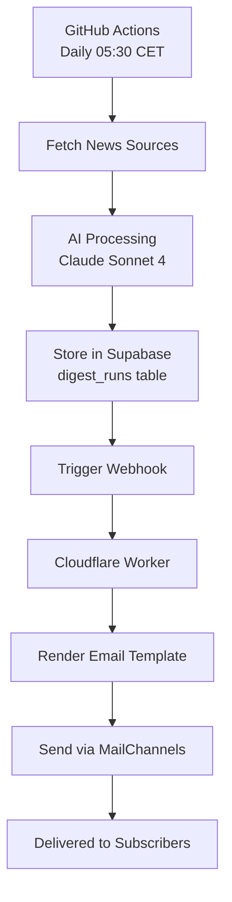

# 🤖 Budbringer

**AI-powered daily newsletter service for Norwegian recipients**

Budbringer is a fully automated AI newsletter system that generates and delivers daily AI briefings in Norwegian. Built with modern web technologies and powered by leading AI models.

[](https://nextjs.org/)
[](https://react.dev/)
[](https://www.typescriptlang.org/)
[](https://supabase.com/)

## 🏗️ Architecture

- **Frontend**: Next.js 15 app with React 19 for public landing page and admin panel
- **Database**: Supabase PostgreSQL with migrations for subscribers, prompts, and run logs
- **AI Models**: Anthropic Claude Sonnet 4 (Sept 2025) and OpenAI GPT-4o for intelligent content generation
- **Automation**: Daily GitHub Actions workflow for content generation
- **Email Delivery**: Cloudflare Worker with MailChannels for reliable email sending
- **Styling**: Tailwind CSS 3.4 for modern, responsive design
- **Subscriber Management**: Approval workflow for new subscriber requests

## 🚀 Tech Stack

| Category | Technology | Version | Purpose |
|----------|------------|---------|---------|
| **Frontend** | Next.js | 15.5.4 | React framework with App Router |
| **UI Library** | React | 19.1.1 | Component library |
| **Language** | TypeScript | 5.9.2 | Type-safe development |
| **Database** | Supabase | 2.57.4 | PostgreSQL with real-time features |
| **Auth** | Supabase SSR | 0.7.0 | Server-side authentication |
| **Styling** | Tailwind CSS | 3.4.4 | Utility-first CSS framework |
| **AI Models** | Anthropic SDK | 0.63.1 | Claude Sonnet 4 (Sept 2025) integration |
| **AI Models** | OpenAI SDK | 5.23.0 | GPT integration |
| **Email** | MailChannels | - | Transactional email delivery |
| **Deployment** | Cloudflare Workers | - | Serverless email dispatcher |
| **Linting** | ESLint | 9.36.0 | Code quality and consistency |

## 🏁 Getting Started

### Prerequisites

- **Node.js**: 22.x LTS (recommended) or 20.x
- **npm**: Latest version
- **Supabase Account**: For database and authentication
- **API Keys**: Anthropic and/or OpenAI for AI generation

### Local Development

1. **Clone the repository**
   ```bash
   git clone https://github.com/elzacka/budbringer.git
   cd budbringer
   ```

2. **Install dependencies**
   ```bash
   npm install
   ```

3. **Environment Setup**
   ```bash
   cp .env.example .env.local
   # Fill in your Supabase project details and API keys
   ```

4. **Database Setup**
   ```bash
   # Using Supabase CLI (recommended)
   supabase db push

   # Or run migrations manually
   supabase migration up
   ```

5. **Start Development Server**
   ```bash
   npm run dev
   ```

The application will be available at `http://localhost:3000`.

### Admin Setup

To access the admin panel, mark admin users in Supabase Auth:
```sql
UPDATE auth.users
SET app_metadata = '{"roles": ["admin"]}'::jsonb
WHERE email = 'your-admin-email@example.com';
```

## ⚙️ Environment Variables

Create `.env.local` with the following variables:

| Variable | Description | Required |
|----------|-------------|----------|
| `NEXT_PUBLIC_SUPABASE_URL` | Your Supabase project URL | ✅ |
| `NEXT_PUBLIC_SUPABASE_ANON_KEY` | Supabase publishable/anon key | ✅ |
| `SUPABASE_SERVICE_URL` | Supabase project URL (same as above) | ✅ |
| `SUPABASE_SECRET_KEY` | Supabase secret/service role key | ✅ |
| `ANTHROPIC_API_KEY` | Anthropic Claude Sonnet 4 API key | ⚠️* |
| `OPENAI_API_KEY` | OpenAI GPT API key | ⚠️* |
| `MAILCHANNELS_AUTH_TOKEN` | MailChannels API token | ✅ |
| `PUBLIC_SITE_URL` | Base URL for signed links | ✅ |
| `UNSUBSCRIBE_SECRET` | Secret key for signed unsubscribe links | ✅ |
| `DISPATCH_TOKEN` | Secret token for webhook security | ✅ |
| `ENABLE_TTS` | Enable text-to-speech features (`true`/`false`) | ❌ |
| `PIPER_VOICE` | Piper voice model for TTS | ❌ |

*At least one AI API key (Anthropic or OpenAI) is required for content generation.

## 🔄 Production Workflow

The automated newsletter generation follows this workflow:

1. **Daily Trigger**: GitHub Actions workflow runs at 05:30 CET
2. **Content Generation**: `scripts/dailyDigest.ts` processes news sources using Claude Sonnet 4
3. **Data Storage**: Results saved to `digest_runs` and `content_items` tables
4. **Email Dispatch**: Cloudflare Worker triggered via secure webhook
5. **Delivery**: Worker fetches latest digest and sends via MailChannels

### 👥 Subscriber Management

New subscribers go through an approval process:

1. **Subscription**: Users submit email via landing page form
2. **Pending Status**: New subscribers get `pending` status requiring admin approval
3. **Admin Review**: Admins approve/reject subscribers via `/admin/pending` interface
4. **Email Delivery**: Only `confirmed` subscribers receive daily newsletters

### 📧 Unsubscribe System

Automated unsubscribe handling for GDPR compliance:

1. **Secure Links**: Newsletter contains signed unsubscribe link with HMAC verification
2. **Automatic Processing**: Click processes unsubscribe immediately in database
3. **External Redirect**: Users redirected to external website with confirmation
4. **Data Transparency**: Comprehensive information about data storage and handling
5. **API Integration**: External website can query subscription status and data locations



## 🤖 AI-Powered Content Generation

Budbringer leverages cutting-edge AI technology for intelligent newsletter curation:

### **Claude Sonnet 4 (September 2025)**
- **Latest Model**: Updated to Anthropic's newest Claude Sonnet 4 (claude-sonnet-4-20250514)
- **High Performance**: Exceptional reasoning capabilities optimized for content creation
- **Cost Efficient**: 5x more cost-effective than Opus while maintaining excellent quality
- **Large Context**: Supports up to 1M token context window for processing multiple news sources
- **Norwegian Optimization**: Fine-tuned prompts for Norwegian language and cultural context

### **Intelligent News Processing**
- **Multi-Source Aggregation**: Fetches from NRK, ITavisen, TechCrunch, MIT Tech Review, and more
- **Relevance Filtering**: AI-powered keyword matching and content analysis
- **Content Synthesis**: Transforms raw news into structured Norwegian newsletter format
- **Quality Control**: Validates output format and ensures consistent newsletter structure

## 📊 Available Scripts

| Command | Description |
|---------|-------------|
| `npm run dev` | Start development server |
| `npm run build` | Build production application |
| `npm run start` | Start production server |
| `npm run lint` | Run ESLint code quality checks |
| `npm run digest:generate` | Manually generate daily digest with Claude Sonnet 4 |
| `npm run sources:test` | Test content source connections |
| `npm run ai:test` | Test Claude Sonnet 4 AI integration |

### Admin Panel Features

- **Dashboard** (`/admin`): Overview of subscriber stats and recent runs
- **Pending Approvals** (`/admin/pending`): Approve/reject new subscriber requests with comments
- **Recipients** (`/admin/recipients`): Manage subscriber list, status, and deletions
- **Prompts** (`/admin/prompts`): Configure AI prompts with versioning
- **Runs** (`/admin/runs`): Monitor newsletter generation history

### Privacy & GDPR Compliance

- **Transparent Data Handling**: Complete documentation of data storage across all systems
- **External Website Integration**: API endpoints for subscription verification and data details
- **Secure Unsubscribe**: HMAC-signed links prevent tampering and unauthorized unsubscribes
- **Data Location Transparency**: Clear information about EU data storage and retention policies
- **User Rights Support**: Access, rectification, and deletion rights fully supported

## 🎵 TTS Features (Optional)

Enable text-to-speech generation for audio newsletters:

1. Set `ENABLE_TTS=true` in GitHub Secrets
2. Configure `PIPER_VOICE` with desired voice model (e.g., `nb_NO-karlsen-medium`)
3. Audio files are stored in Supabase Storage (`digests` bucket)
4. Links automatically included in email newsletters

## 🚀 Deployment

### Vercel (Recommended)

1. Connect your GitHub repository to Vercel
2. Configure environment variables in Vercel dashboard
3. Deploy automatically on push to main branch

### Cloudflare Workers

The email dispatcher runs on Cloudflare Workers:

1. Deploy `workers/email-dispatcher.js` to Cloudflare
2. Configure environment variables
3. Update webhook URL in GitHub Actions

## 🔐 Security

- All API keys stored as environment variables
- Signed unsubscribe links with HMAC verification
- Admin access controlled via Supabase RLS policies
- Webhook authentication with secure tokens

## 🛠️ Development

### Database Migrations

New migrations go in `supabase/migrations/`:
```bash
# Create new migration
supabase migration new your_migration_name

# Apply migrations
supabase db push
```

### Adding New AI Prompts

1. Use admin panel at `/admin/prompts`
2. Create new prompt with versioning
3. Set as active for next generation cycle

## 🤝 Contributing

1. Fork the repository
2. Create a feature branch (`git checkout -b feature/amazing-feature`)
3. Commit your changes (`git commit -m 'Add amazing feature'`)
4. Push to the branch (`git push origin feature/amazing-feature`)
5. Open a Pull Request

## 📝 License

This project is licensed under the MIT License - see the [LICENSE](LICENSE) file for details.

## ✨ Roadmap

- [ ] Per-subscriber preferences (topics, frequency, format)
- [ ] Slack/Teams integration for alternative delivery channels
- [ ] Advanced analytics and engagement tracking
- [ ] Multi-language support beyond Norwegian
- [ ] RSS feed generation
- [ ] Mobile app for content management

---

**Built with ❤️ for the Norwegian AI community**
